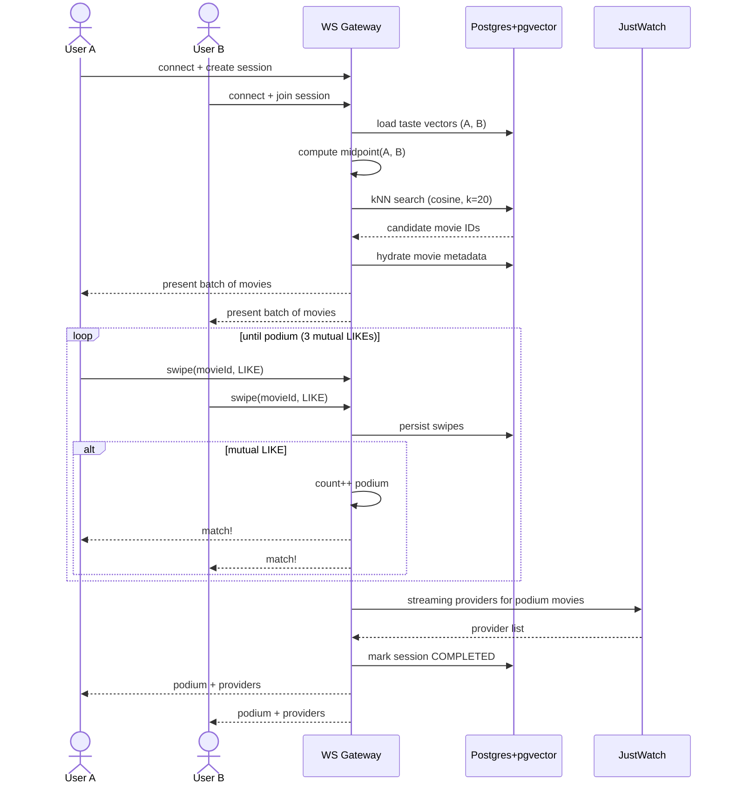

# 02. Arquitetura

> **TL;DR** — NestJS faz API + WebSocket + workers. FastAPI faz só inferência SBERT. Postgres com pgvector guarda tudo (relacional + vetorial). Redis é fila (BullMQ) e cache. Letterboxd é integrado via RSS + scraping leve. Tudo orquestrado via Docker Compose.

## 2.1. Visão de componentes

```mermaid
graph TD
    %% Clients
    ClientA[Frontend<br/>React/Next/RN — TBD]
    ClientB[Frontend<br/>React/Next/RN — TBD]

    %% External APIs
    LB[Letterboxd<br/>RSS + HTML público]
    TMDB[TMDB API<br/>metadados + sinopses]
    JW[JustWatch API<br/>streaming providers]

    %% Backend
    subgraph "NestJS API"
        WS[WebSocket Gateway<br/>lobby + swipes em tempo real]
        REST[REST Controllers<br/>auth, friends, histórico]
        Producer[BullMQ Producer]
    end

    subgraph "Background"
        Redis[(Redis<br/>filas + cache + pub-sub)]
        WProfile[Worker Profile Sync<br/>Letterboxd → DB]
        WEmbed[Worker Embeddings<br/>sinopse → vetor]
    end

    subgraph "ML"
        ML[FastAPI<br/>SBERT inference]
    end

    subgraph "Persistência"
        PG[(PostgreSQL<br/>+ pgvector)]
    end

    ClientA <-->|WebSocket| WS
    ClientB <-->|WebSocket| WS
    ClientA -->|REST + JWT| REST

    REST -->|leitura rápida| PG
    REST -->|dispatch JIT| Producer
    Producer --> Redis

    Redis --> WProfile
    Redis --> WEmbed
    WProfile -->|RSS + scrape| LB
    WProfile -->|upsert user data| PG
    WProfile -->|novo filme?| Producer

    WEmbed -->|sinopse| TMDB
    WEmbed -->|texto → vetor| ML
    WEmbed -->|salva metadados + vetor| PG

    WS -->|kNN cosine| PG
    WS -->|metadados visuais| PG
    WS -->|streaming providers do pódio| JW
    WS -->|persiste resultado| PG
```

Fonte editável: [diagrams/flow.mmd](diagrams/flow.mmd).

## 2.2. Por que essas escolhas

### NestJS para API + workers
- **WebSocket gateway nativo** com decorators, rooms e namespaces. O core do produto (sessão de match) é tempo-real puro.
- **BullMQ é first-class** via `@nestjs/bullmq` — DI, decorators, observabilidade.
- A spec original já foi escrita em termos NestJS (Prisma, BullMQ, gateway). Manter alinhamento reduz fricção.
- DI modular escala bem quando expandirmos pra sessões >2 usuários.

### FastAPI **só** para o microsserviço SBERT
- Inferência ML pertence ao ecossistema Python (transformers, sentence-transformers).
- Isolado num serviço HTTP separado pra que carga de inferência não bloqueie o event loop da API.
- Comunicação: worker Node faz `POST /embed` com batch de textos → recebe vetores.

### PostgreSQL + pgvector (e não Pinecone)
- **Um banco só**, sem serviço externo gerenciado.
- `pgvector` suporta cosine similarity nativo (`vector <=> vector`) e índices HNSW/IVFFlat.
- Free tier / self-hosted via Docker. Escala bem até milhões de vetores.
- Migração pra Pinecone/Qdrant é possível depois se precisarmos: o código de busca fica isolado num repositório (interface).

### BullMQ (e não RabbitMQ)
- BullMQ = biblioteca de **background jobs** (delayed, retry, scheduled, repeating) em cima do Redis. Caso de uso direto.
- RabbitMQ = **message broker** general-purpose (AMQP), feito pra roteamento entre serviços heterogêneos. Aqui temos uma única ponte Node↔Python que vira HTTP simples.
- Bull Board dá dashboard pronto pra inspecionar filas em dev/prod.

### Redis
Triplo uso: backing store do BullMQ, cache (perfis sincronizados, listas TMDB), e eventualmente pub-sub pra sincronizar WebSocket entre múltiplas instâncias da API.

## 2.3. Fluxo Just-In-Time (JIT) de sincronização

Quando o usuário abre o app e entra num lobby:

1. **Resposta instantânea** — a API serve os dados em cache do Postgres (perfil, watchlist conhecida, embeddings).
2. **Trigger assíncrono** — em paralelo, um job `sync-profile` é enfileirado no Redis sem aguardar.
3. **Worker Profile Sync** pega o job:
   - Lê RSS do diário → identifica filmes novos com nota 4-5★.
   - Scrape leve da watchlist e dos 4 favoritos pinados (se passou o TTL).
   - Faz upsert no Postgres.
   - Pra cada filme novo (ainda sem embedding), enfileira `embed-movie`.
4. **Worker Embeddings** pega o job:
   - Busca sinopse no TMDB.
   - Chama `POST /embed` no microsserviço ML.
   - Grava metadados + vetor no Postgres.

Resultado: o lobby abre em <100ms e os filmes novos aparecem nos próximos swipes sem o usuário esperar.

## 2.4. Fluxo de match (WebSocket)



Detalhes do algoritmo em [05-match-algorithm.md](05-match-algorithm.md). Contratos detalhados em [04-api-contracts.md](04-api-contracts.md).

## 2.5. Running locally

A spec completa de subida do ambiente está em evolução. O alvo final:

```bash
cp .env.example .env
docker compose up -d                # tudo: postgres, redis, api, worker, ml
docker compose exec api npx prisma migrate deploy
```

Por agora (Fase 1 — só infra), o que está pronto:

```bash
docker compose up -d postgres redis
```

Os serviços `api`, `worker` e `ml` ainda serão scaffoldados nas próximas fases.

## 2.6. Por que não X?

- **Por que não um único monorepo Python?** Porque o WebSocket gateway do NestJS é dramaticamente melhor do que rodar Socket.IO ou aiohttp WS na mão.
- **Por que não Next.js API routes em vez de NestJS?** Porque a lógica de sessão é stateful (rooms, presence) e WS-first. API routes do Next são feitas pra request/response sem estado.
- **Por que não Kafka em vez de BullMQ?** Kafka é overkill pra background jobs. BullMQ + Redis cobre 100% do que precisamos com 10% da complexidade operacional.
- **Por que não tRPC?** Cliente ainda não decidido. tRPC força TypeScript no front e perde valor se escolhermos React Native + outra linguagem ou expor SDK pra terceiros. REST + WS é mais portável.
