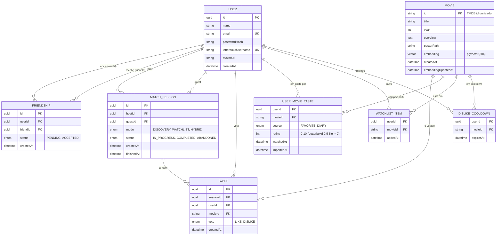

# 03. Modelo de Dados

> **TL;DR** — Cinco entidades principais (User, Friendship, Movie, MatchSession, Swipe) num Postgres com extensão pgvector. Friendship e Swipe têm constraints únicos compostos. O vetor de cada filme vive na própria tabela Movie como coluna `vector(384)`.

## 3.1. Diagrama Entidade-Relacionamento



Fonte editável: [diagrams/erd.mmd](diagrams/erd.mmd).

## 3.2. Entidades — detalhamento

### USER
Conta principal. O `email + passwordHash` cobre o auth do MVP (JWT). `letterboxdUsername` é único porque dois usuários CineMatch não devem mapear pro mesmo perfil Letterboxd (evita duplicação de scraping e ambiguidade no perfil de gosto).

### FRIENDSHIP
Auto-relacionamento na tabela USER. Estados: `PENDING` (solicitação enviada) e `ACCEPTED`. **Constraint único composto** `(userId, friendId)` para impedir duplicatas. Convenção: ao aceitar, criamos um segundo registro espelhado `(friendId, userId)` também ACCEPTED, ou tratamos a amizade como bidirecional via query (decisão a tomar na Fase 3).

### MOVIE
ID unificado vindo do **TMDB** (canonical). Letterboxd usa slugs próprios mas mantemos o mapeamento via TMDB ID por ser estável e numérico. A coluna `embedding vector(384)` é o vetor SBERT (modelo `all-MiniLM-L6-v2` produz 384 dimensões). `embeddingUpdatedAt` permite re-embeddar se trocarmos o modelo.

### MATCH_SESSION
Uma partida entre exatamente dois usuários. `mode` define o algoritmo de candidatos (Descoberta vs Limpa-Fila). `status`:
- `IN_PROGRESS` — em andamento.
- `COMPLETED` — pódio fechado (3 matches).
- `ABANDONED` — usuário saiu sem completar (timeout de inatividade ou disconnect).

### SWIPE
Tabela de junção estendida — vota um usuário num filme dentro de uma sessão. **Constraint único composto** `(sessionId, userId, movieId)` impede voto duplicado.

### USER_MOVIE_TASTE *(nova vs spec original)*
Armazena os filmes que compõem o perfil de gosto do usuário. `source` distingue:
- `FAVORITE` — um dos 4 pinados no perfil Letterboxd (peso maior na composição do vetor).
- `DIARY` — filme assistido com nota alta (4-5★ no Letterboxd, equivalente 8-10 na escala 0-10).

Essa tabela é o que o worker de Profile Sync popula. O vetor de gosto do usuário é **computado on-the-fly** (média ponderada) quando uma sessão começa, não armazenado — assim ele reflete sempre o estado mais recente sem invalidação.

### WATCHLIST_ITEM *(nova vs spec original)*
Lista "Quero Ver" sincronizada do Letterboxd. Usada exclusivamente pelo Modo Limpa-Fila pra calcular interseção.

### DISLIKE_COOLDOWN *(nova vs spec original)*
Implementa a regra do "cooldown de dislikes" descrita em [07-gamification.md](07-gamification.md). `expiresAt` é uma data futura calculada como `now() + DISLIKE_COOLDOWN_DAYS`. Pode ser TTL no Redis também, mas Postgres facilita queries do tipo "exclua dos candidatos os filmes em cooldown".

## 3.3. Schema Prisma (anotado)

O arquivo canônico vive em `packages/database/prisma/schema.prisma` (será criado na Fase 2). Abaixo a versão anotada de referência:

```prisma
generator client {
  provider = "prisma-client-js"
  previewFeatures = ["postgresqlExtensions"]
}

datasource db {
  provider   = "postgresql"
  url        = env("DATABASE_URL")
  extensions = [pgvector(map: "vector")]
}

model User {
  id                 String   @id @default(uuid())
  name               String
  email              String   @unique
  passwordHash       String
  letterboxdUsername String?  @unique
  avatarUrl          String?
  createdAt          DateTime @default(now())

  friendshipsSent     Friendship[]      @relation("FriendshipSender")
  friendshipsReceived Friendship[]      @relation("FriendshipReceiver")
  hostedSessions      MatchSession[]    @relation("SessionHost")
  guestSessions       MatchSession[]    @relation("SessionGuest")
  swipes              Swipe[]
  tasteMovies         UserMovieTaste[]
  watchlist           WatchlistItem[]
  dislikeCooldowns    DislikeCooldown[]
}

model Friendship {
  id        String           @id @default(uuid())
  userId    String
  friendId  String
  status    FriendshipStatus @default(PENDING)
  createdAt DateTime         @default(now())

  user   User @relation("FriendshipSender",   fields: [userId],   references: [id])
  friend User @relation("FriendshipReceiver", fields: [friendId], references: [id])

  @@unique([userId, friendId])
}

enum FriendshipStatus {
  PENDING
  ACCEPTED
}

model Movie {
  id                  String   @id // TMDB ID as string for forward-compat
  title               String
  year                Int
  overview            String   @db.Text
  posterPath          String?
  // vector(384) — managed via raw SQL migration; Prisma sees it as Unsupported
  embedding           Unsupported("vector(384)")?
  embeddingUpdatedAt  DateTime?
  createdAt           DateTime @default(now())

  swipes           Swipe[]
  tasteEntries     UserMovieTaste[]
  watchlistEntries WatchlistItem[]
  cooldowns        DislikeCooldown[]
}

model MatchSession {
  id         String        @id @default(uuid())
  hostId     String
  guestId    String
  mode       SessionMode   @default(DISCOVERY)
  status     SessionStatus @default(IN_PROGRESS)
  createdAt  DateTime      @default(now())
  finishedAt DateTime?

  host  User    @relation("SessionHost",  fields: [hostId],  references: [id])
  guest User    @relation("SessionGuest", fields: [guestId], references: [id])
  swipes Swipe[]
}

enum SessionMode {
  DISCOVERY
  WATCHLIST
  HYBRID
}

enum SessionStatus {
  IN_PROGRESS
  COMPLETED
  ABANDONED
}

model Swipe {
  id        String   @id @default(uuid())
  sessionId String
  userId    String
  movieId   String
  vote      VoteType
  createdAt DateTime @default(now())

  session MatchSession @relation(fields: [sessionId], references: [id])
  user    User         @relation(fields: [userId],    references: [id])
  movie   Movie        @relation(fields: [movieId],   references: [id])

  @@unique([sessionId, userId, movieId])
  @@index([sessionId, vote])
}

enum VoteType {
  LIKE
  DISLIKE
}

model UserMovieTaste {
  userId     String
  movieId    String
  source     TasteSource
  rating     Int?
  watchedAt  DateTime?
  importedAt DateTime    @default(now())

  user  User  @relation(fields: [userId],  references: [id])
  movie Movie @relation(fields: [movieId], references: [id])

  @@id([userId, movieId, source])
  @@index([userId, source])
}

enum TasteSource {
  FAVORITE
  DIARY
}

model WatchlistItem {
  userId  String
  movieId String
  addedAt DateTime @default(now())

  user  User  @relation(fields: [userId],  references: [id])
  movie Movie @relation(fields: [movieId], references: [id])

  @@id([userId, movieId])
}

model DislikeCooldown {
  userId    String
  movieId   String
  expiresAt DateTime

  user  User  @relation(fields: [userId],  references: [id])
  movie Movie @relation(fields: [movieId], references: [id])

  @@id([userId, movieId])
  @@index([userId, expiresAt])
}
```

## 3.4. Índices vetoriais

Após o `prisma migrate`, rodar manualmente uma migração SQL pra criar o índice HNSW (Prisma não suporta nativamente):

```sql
CREATE INDEX movie_embedding_hnsw_idx
  ON "Movie"
  USING hnsw (embedding vector_cosine_ops);
```

Esse índice acelera buscas kNN aproximadas de `O(n)` pra `O(log n)`. Para o MVP com poucos milhares de filmes, IVFFlat também serve e indexa mais rápido:

```sql
CREATE INDEX movie_embedding_ivfflat_idx
  ON "Movie"
  USING ivfflat (embedding vector_cosine_ops)
  WITH (lists = 100);
```

Decisão de qual índice usar fica pra Fase 5 quando tivermos dados reais.

## 3.5. Decisões de modelagem (vs spec original)

| Mudança | Por que |
|---|---|
| Adicionado `email` + `passwordHash` no User | A spec não cobriu auth; precisamos pro JWT |
| `letterboxdUsername` virou opcional (`String?`) | Usuário pode entrar antes de conectar Letterboxd |
| Movie ganhou `embedding` direto na tabela | Com pgvector, não precisamos de DB vetorial separado — colocar o vetor junto do metadado simplifica join |
| Adicionado `UserMovieTaste`, `WatchlistItem`, `DislikeCooldown` | A spec menciona essas regras (4 favs + 15 diary, watchlist, cooldown) mas não modela — sem isso, o algoritmo não tem onde ler |
| `MatchSession.mode` adicionado | Spec lista 3 modos mas não armazena qual modo foi usado por sessão |
| Vetor do usuário **não é armazenado** | Calculamos on-the-fly a partir de `UserMovieTaste`; evita problemas de invalidação quando perfil muda |

## 3.6. Migrations e seeds

- **Migrations** via `prisma migrate dev` em desenvolvimento, `prisma migrate deploy` em produção.
- **Extensão pgvector** habilitada via migração SQL antes da primeira tabela com `vector`:
  ```sql
  CREATE EXTENSION IF NOT EXISTS vector;
  ```
- **Seeds** ficam em `packages/database/prisma/seed.ts` — popularão um catálogo mínimo de filmes pra dev (top 100 do TMDB com embeddings pré-calculados).
