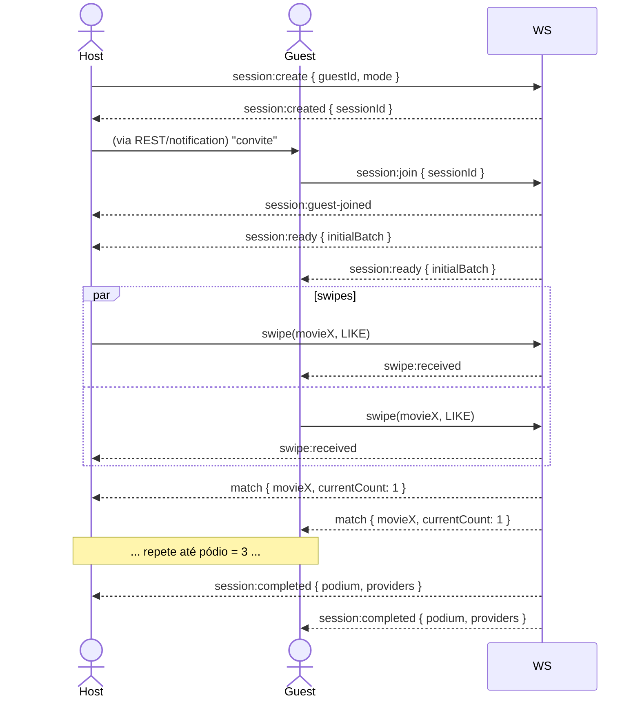

# 04. Contratos de API

> **TL;DR** — REST para tudo que é stateless (auth, friends, histórico, perfil) e WebSocket para a sessão de match em tempo real. Auth via JWT no header `Authorization: Bearer`. Eventos WS namespaced em `/match`.

Este documento é a referência canônica. Quando endpoints forem implementados, manter sincronizado. O OpenAPI será gerado automaticamente pelo NestJS via `@nestjs/swagger` e exposto em `/api/docs`.

## 4.1. Convenções

- **Base URL**: `http://localhost:3000` em dev. Prefixo `/api/v1` em todos os REST endpoints.
- **Auth**: JWT no header `Authorization: Bearer <token>`. Tokens expiram em 7 dias; refresh ainda não está no v1 (usuário re-loga).
- **Erros**: formato padronizado:
  ```json
  {
    "statusCode": 400,
    "message": "Validation failed",
    "error": "Bad Request",
    "details": [{ "field": "email", "issue": "invalid format" }]
  }
  ```
- **IDs**: UUID v4 pra entidades internas (User, Session, Swipe, Friendship); string (TMDB ID) pra Movie.
- **Datas**: ISO 8601 UTC (`2026-05-25T22:30:00Z`).

## 4.2. REST endpoints

### Auth — `/api/v1/auth`

| Método | Path | Body | Resposta | Notas |
|---|---|---|---|---|
| `POST` | `/register` | `{ name, email, password, letterboxdUsername? }` | `{ user, accessToken }` | Senha mínimo 8 chars |
| `POST` | `/login` | `{ email, password }` | `{ user, accessToken }` | |
| `GET`  | `/me` | — | `{ user }` | Auth obrigatório |
| `PATCH`| `/me` | `{ name?, avatarUrl?, letterboxdUsername? }` | `{ user }` | Mudar `letterboxdUsername` dispara `sync-profile` |

### Friends — `/api/v1/friends`

| Método | Path | Body | Resposta | Notas |
|---|---|---|---|---|
| `GET`    | `/`        | — | `Friend[]` | Lista de amigos aceitos |
| `GET`    | `/pending` | — | `Friendship[]` | Solicitações recebidas, status PENDING |
| `POST`   | `/request` | `{ friendId }` ou `{ email }` | `Friendship` | Cria com status PENDING |
| `POST`   | `/:id/accept` | — | `Friendship` | |
| `DELETE` | `/:id` | — | `204` | Cancela solicitação ou remove amizade |

### Movies — `/api/v1/movies`

| Método | Path | Body | Resposta | Notas |
|---|---|---|---|---|
| `GET` | `/:id` | — | `Movie` | Dados visuais (poster, título, sinopse) |
| `GET` | `/search?q=` | — | `Movie[]` | Busca full-text simples — pra UI de "adicionar manualmente" |

### Sessions — `/api/v1/sessions`

A criação e o ciclo de vida principais acontecem via WebSocket, mas REST cobre histórico:

| Método | Path | Body | Resposta | Notas |
|---|---|---|---|---|
| `GET` | `/`     | — | `MatchSession[]` | Histórico do usuário (host ou guest) |
| `GET` | `/:id`  | — | `MatchSessionDetails` | Com swipes, pódio, providers |

### Profile sync — `/api/v1/profile`

| Método | Path | Body | Resposta | Notas |
|---|---|---|---|---|
| `POST` | `/letterboxd/sync` | — | `{ jobId }` | Dispara job manual de sync. Idempotente — se já tem job pendente, retorna o existente |
| `GET`  | `/letterboxd/status` | — | `{ lastSyncedAt, status, watchlistCount, tasteCount }` | |
| `POST` | `/letterboxd/import-csv` | `multipart` | `{ jobId }` | Fallback CSV |

### Health / Misc

| Método | Path | Resposta | Notas |
|---|---|---|---|
| `GET` | `/health` | `{ status, db, redis, ml }` | Liveness/readiness |
| `GET` | `/api/docs` | Swagger UI | |

## 4.3. WebSocket — namespace `/match`

Cliente conecta em `ws://localhost:3000/match` com query `?token=<jwt>` (Socket.IO ou native — decisão na Fase 6).

### Eventos do cliente → servidor

| Evento | Payload | Quando |
|---|---|---|
| `session:create` | `{ guestId, mode: "DISCOVERY"\|"WATCHLIST" }` | Host cria sala e fica esperando |
| `session:join` | `{ sessionId }` | Guest aceita o convite |
| `session:leave` | `{ sessionId }` | Sair voluntariamente (marca ABANDONED se a sessão tava IN_PROGRESS) |
| `swipe` | `{ sessionId, movieId, vote: "LIKE"\|"DISLIKE" }` | A cada deslize |
| `request-next-batch` | `{ sessionId, count: 10 }` | Cliente pede mais filmes quando a fila local estiver baixa |
| `ping` | — | Heartbeat (servidor responde `pong`) |

### Eventos do servidor → cliente

| Evento | Payload | Quando |
|---|---|---|
| `session:created` | `MatchSession` | Confirmação da criação |
| `session:guest-joined` | `{ user }` | Host recebe quando guest entra |
| `session:ready` | `{ session, initialBatch: Movie[] }` | Ambos recebem quando o lobby está pronto e o primeiro batch foi calculado |
| `batch` | `Movie[]` | Próximo lote de candidatos |
| `swipe:received` | `{ userId, movieId, vote }` | Notifica o outro player de que houve voto (sem revelar resultado) |
| `match` | `{ movie, currentCount, podiumSize }` | Quando há LIKE mútuo |
| `session:completed` | `{ podium: Movie[], providers: ProviderInfo[] }` | Pódio fechado (3 matches) |
| `session:abandoned` | `{ reason }` | Outro player saiu / timeout |
| `error` | `{ code, message }` | Qualquer erro |
| `pong` | — | Resposta de heartbeat |

### Fluxo canônico



## 4.4. Modelos compartilhados (DTOs)

Tipos resumidos — versão TypeScript canônica em `packages/database` ou shared lib (decidir na Fase 2).

```ts
type User = {
  id: string;
  name: string;
  email: string;
  letterboxdUsername: string | null;
  avatarUrl: string | null;
  createdAt: string;
};

type Movie = {
  id: string;            // TMDB id
  title: string;
  year: number;
  overview: string;
  posterPath: string | null;
};

type MatchSession = {
  id: string;
  hostId: string;
  guestId: string;
  mode: 'DISCOVERY' | 'WATCHLIST' | 'HYBRID';
  status: 'IN_PROGRESS' | 'COMPLETED' | 'ABANDONED';
  createdAt: string;
  finishedAt: string | null;
};

type ProviderInfo = {
  movieId: string;
  providers: Array<{ name: string; logoUrl: string; deepLink?: string }>;
};
```

## 4.5. Rate limiting (planejado)

- Auth endpoints: 5 req/min por IP (anti-brute-force).
- `/profile/letterboxd/sync`: 1 req/min por usuário (evita abuso do scraping).
- WebSocket `swipe`: 5 req/s por usuário por sessão (proteção contra spam).

Implementação via `@nestjs/throttler` na Fase 3.
