# 06. Integração com Letterboxd

> **TL;DR** — Letterboxd não tem API pública. Usamos RSS (oficial, gratuito) pro diário e scraping leve com Cheerio pros favoritos pinados e a watchlist. Sync acontece em background via BullMQ. Cache agressivo no Postgres com TTL. CSV import existe como fallback resiliente.

## 6.1. O que precisamos extrair

A spec do produto exige três fontes de dados:

| Fonte | Quantidade | Pra quê |
|---|---|---|
| **Favoritos pinados** (4 fixos) | 4 por usuário | Compor metade do vetor de gosto |
| **Diary com 4-5★** | últimos 15 | Compor outra metade do vetor de gosto |
| **Watchlist** | full | Modo Limpa-Fila |

## 6.2. O que o Letterboxd oferece

| Recurso | Disponível? | Como |
|---|---|---|
| API REST oficial | ❌ não pública | Parceria fechada, improvável de aprovar |
| RSS do diário | ✅ sim | `https://letterboxd.com/{user}/rss/` |
| RSS da watchlist | ❌ não existe | — |
| RSS de listas customizadas | ✅ sim | `https://letterboxd.com/{user}/list/{slug}/rss/` |
| Perfil HTML público | ✅ sim | `https://letterboxd.com/{user}/` (server-rendered) |
| CSV export oficial | ✅ sim | Settings → Export your data |

## 6.3. Estratégia híbrida (RSS + scraping)

### RSS do diário
- URL: `https://letterboxd.com/{username}/rss/`
- Frequência de sync: **a cada login + 1×/hora durante uso ativo**.
- Parser: `rss-parser` (npm). Cada item tem `<title>`, `<pubDate>`, `<letterboxd:watchedDate>`, `<letterboxd:memberRating>`, `<tmdb:movieId>`.
- O TMDB ID vem direto no RSS — não precisa scraping pra mapear o filme.
- Filtro: só processamos itens com `memberRating >= 4.0` (que viram `rating >= 8` na escala 0-10 do nosso schema).

### Scraping do perfil (favoritos pinados)
- URL: `https://letterboxd.com/{username}/`
- Frequência de sync: **1×/dia** (favoritos mudam raramente).
- Parser: Cheerio.
- Seletor (a confirmar na implementação): `section#favourites .poster-list li.poster-container .film-poster`. Cada `<div class="film-poster">` tem `data-film-slug`. O TMDB ID vem da página de detalhe do filme: `https://letterboxd.com/film/{slug}/` → meta tag `<meta property="og:url">` ou link com `/tmdb/{id}/`.
- Otimização: cache do mapeamento `letterboxd-slug → tmdb-id` no Postgres (tabela auxiliar simples ou na Movie via coluna `letterboxdSlug`).

### Scraping da watchlist
- URL: `https://letterboxd.com/{username}/watchlist/` (paginada, `?page=2`, etc.)
- Frequência de sync: **JIT ao entrar no lobby de uma sessão modo Limpa-Fila** + TTL de 1h.
- Parser: Cheerio, mesmo seletor da grade de filmes do site.
- Concorrência: 1 página por vez por usuário, delay de 500ms entre páginas.

## 6.4. Etiqueta de scraping

Regras não-negociáveis:

1. **User-Agent identificável**: `CineMatch/0.1 (+https://cinematch.example.com)`. Nunca passar como browser comum.
2. **Concorrência por usuário**: 1 request por segundo no máximo.
3. **Concorrência global**: até 5 requests simultâneos pra letterboxd.com no worker (configurável `LETTERBOXD_GLOBAL_CONCURRENCY=5`).
4. **Cache agressivo**: nada de re-scrapear o que já temos dentro do TTL.
5. **Respeitar 429/503**: backoff exponencial, suspender por 5 min em caso de bloqueio.
6. **Sem JS rendering**: páginas necessárias são server-rendered. Cheerio basta — não usar Playwright.

## 6.5. Arquitetura do worker

Módulo único: `apps/worker/src/letterboxd/`.

```
letterboxd/
├── letterboxd.module.ts
├── jobs/
│   ├── sync-profile.processor.ts    # consome fila "sync-profile"
│   └── import-csv.processor.ts      # consome fila "import-csv"
├── fetchers/
│   ├── diary.fetcher.ts             # RSS parser
│   ├── profile.fetcher.ts           # Cheerio — favoritos
│   ├── watchlist.fetcher.ts         # Cheerio — watchlist paginada
│   └── http.client.ts               # axios singleton com UA + retry
├── mappers/
│   ├── tmdb-resolver.ts             # slug → tmdb id (com cache)
│   └── rating-converter.ts          # 0.5-5★ → 0-10
└── __snapshots__/                   # HTML fixtures pra testes
```

**Princípio**: tudo que toca em HTML do Letterboxd vive aqui. Se o site mudar, a área de cirurgia é uma só.

## 6.6. Fluxo de sync completo

```mermaid
sequenceDiagram
    participant API
    participant Q as BullMQ
    participant W as Worker
    participant LB as Letterboxd
    participant DB as Postgres

    Note over API: usuário entra no app
    API->>DB: read cached profile data (instant)
    API->>Q: enqueue sync-profile{userId}
    API-->>API: responde ao cliente (não bloqueia)

    Q->>W: dispatch
    W->>DB: check lastSyncedAt (skip se TTL não venceu)

    par diary
        W->>LB: GET /{user}/rss/
        LB-->>W: RSS XML
        W->>W: parse, filter rating>=4
    and favorites (se 1d desde último sync)
        W->>LB: GET /{user}/
        LB-->>W: HTML
        W->>W: Cheerio extract pinned
    end

    W->>DB: upsert UserMovieTaste rows
    W->>DB: identify movies new to catalog
    W->>Q: enqueue embed-movie per new movie
    W->>DB: update lastSyncedAt
```



## 6.7. Fallback CSV

Pra usuários que prefiram ou em caso de o scraping quebrar:

- Endpoint `POST /api/v1/profile/letterboxd/import-csv` aceita o ZIP que o Letterboxd entrega no export.
- Worker `import-csv.processor.ts` lê `diary.csv`, `watchlist.csv`, `favorites.csv` (ou equivalente — confirmar nomes ao implementar) e popula as mesmas tabelas.
- TMDB ID **não vem no CSV** — precisamos resolver via TMDB search API (`title + year`). Pior caso e mais lento, mas resiliente.

## 6.8. Tratamento de erros

| Erro | Resposta |
|---|---|
| 404 (usuário não existe) | Marcar `letterboxdUsername` como inválido, notificar usuário |
| 429 / 503 (rate limit ou indisponível) | Backoff exponencial, retry até 5×, suspender worker por 5min se persistir |
| HTML structure changed (seletor não encontrou nada) | Logar com snapshot do HTML, alertar (monitoring), fallback pra última sync |
| RSS malformado | Reportar erro, manter última sync, retry no próximo ciclo |

## 6.9. Testes

- Snapshots do HTML/RSS do Letterboxd vivem em `apps/worker/src/letterboxd/__snapshots__/`.
- Cada parser tem um teste que carrega o snapshot e valida a extração.
- Quando o Letterboxd mudar o HTML, o teste quebra — atualizar snapshot conscientemente, não automaticamente.

## 6.10. Por que não X?

- **Por que não Playwright?** As páginas que precisamos são server-rendered. Playwright traz Chromium (~300MB), drains CPU/RAM, e é overkill.
- **Por que não consumir API do TMDB direto pra "perfil"?** TMDB não tem o sinal de gosto curado — é catálogo. Letterboxd tem o sinal.
- **Por que não pedir login OAuth do Letterboxd?** Não existe OAuth público. E pedir senha do Letterboxd é pior UX e maior risco.
- **Por que não fazer scraping da watchlist toda hora?** Watchlists podem ter centenas de filmes, paginação custa. JIT no lobby + TTL de 1h é o equilíbrio.
